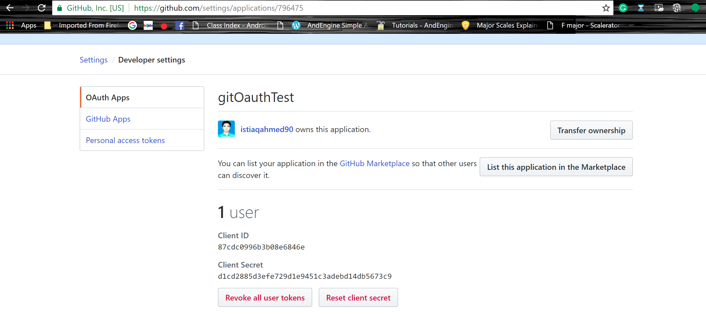
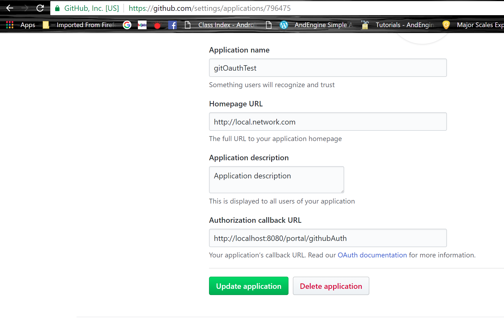
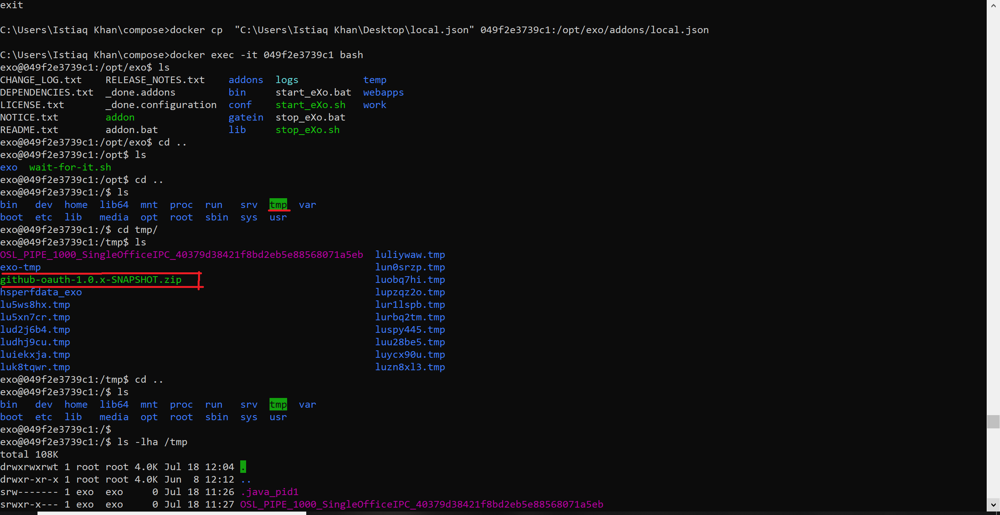
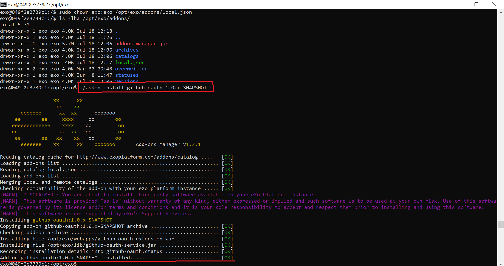

# GitHub Open Authentication addon
This addon allows users to sign into the eXo Platform using their GitHub accounts.

# 1. GitHub web new app settings

# 2. Upload `local.json` file to docker container

## a) optional: on host server where the docker container is running

to familiarize yourself with the docker container, you can bash into it:

`docker exec -it <container_ID> bash`

(`<container_ID>` available via `docker ps -all`)
   
## b) copy file from host server into the docker container

`docker cp "C:\<local_path>\local.json" <container_ID>:/opt/exo/addons/local.json`
   
This is how the file `local.json` should look for telling eXo what local add-ons are available:
   
    [
       {
         "id": "github-oauth",

         "version": "1.0.x-SNAPSHOT",

         "name": "My Github-oauth",

         "description": "Example of my add-on",

         "downloadUrl": "file:///tmp/github-oauth-1.0.x-SNAPSHOT.zip",

         "vendor": "eXo platform",

         "license": "LGPLv3",

         "supportedDistributions": ["community","enterprise"],

         "supportedApplicationServers": ["tomcat","jboss"]
       }
    ]
    
    

# 3. upload `github-oauth-1.0.x-SNAPSHOT.zip` file to `/tmp` folder in docker container

`docker cp "C:\<local_path>\github-oauth-1.0.x-SNAPSHOT.zip" <container_ID>:/tmp/github-oauth-1.0.x-SNAPSHOT.zip`

# 4. change permissions

you might need to change permissions for both `local.json` as well as the add-on so eXo can actually read it.

bash into the docker container

 `docker exec -it <container_ID> bash`

then

  `sudo chown exo:exo /tmp/github-oauth-1.0.x-SNAPSHOT.zip`

  `sudo chown exo:exo /opt/exo/addons/local.json`

# 5. use eXo Add-On Manager to install add-on

bash into the docker container

 `docker exec -it <container_ID> bash`

then go to `/opt/exo` and run the Add-On Manager

 `cd /opt/exo`

`./addon install github-oauth:1.0.x-SNAPSHOT`
   
   
   
   
# 6. copy `exo.properties` file from container to desktop

   `docker cp <container_ID>:/etc/exo/exo.properties "C:\<local_path>\exo.properties"`
   
   add these 3 lines of code at the end of the file & upload it again to the container
   
      exo.oauth.github.enabled=true    
      exo.oauth.github.clientId=87cdc0996b3b08e6846e
      exo.oauth.github.clientSecret=d1cd2885d3efe729d1e9451c3adebd14db5673c9
   
   `docker cp "C:\<local_path>\exo.properties" <container_ID>:/etc/exo/exo.properties`

# 7. restart eXo server

# 8. compiled code sample
     http://www.mediafire.com/file/oyoxnrhcyd1rx3x/github_oauth_working.zip/file

